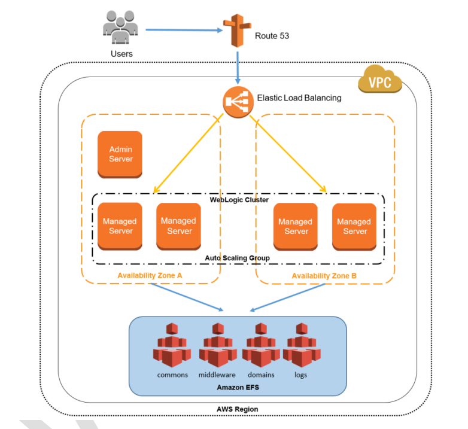

# Oracle WebLogic Architecture on AWS




## 1 - CRIAR SISTEMA DE ARQUIVOS EFS
Nome: efs-weblogic
VPC: padrão

Com o Amazon EFS, você paga somente pelo que usa por mês.

Quando usa o modo de taxa de transferência provisionado, você paga pela taxa de transferência que provisiona a cada mês. Não há taxa mínima nem de custos de configuração.

## 2 - CRIAR MODELO DE EXECUÇÃO
Nome: template-ec2-weblogic

### 2.1 - Criar subnet pública 
Nome: subnet-weblogic-public

### 2.2 - Criar grupo de segurança
Nome: sg-weblogic
Porta: SSH 22
Porta: TCP personalizado 7001

### 2.3 - Criar perfil do IAM para Gerenciamento de Sessão
Nome: role-ec2-ssm

### 2.4 - Colocar Dados de Usuário (Admin Server)
```bash
mkdir /u01
mkdir /u01/oracle
cd /u01/oracle
mkdir commons domains middleware logs
yum update
yum install docker
usermod -a -G docker ec2-user
newgrp docker
systemctl enable docker.service
systemctl start docker.service
#########################
touch domain.properties
echo -e "username=seu_login_ocr\npassword=sua_senha_ocr" > domain.properties
##########################
export username=$(cat domain.properties | grep username | cut -d = -f 2)
export password=$(cat domain.properties | grep password | cut -d = -f 2)
docker login container-registry.oracle.com --username $username --password $password 
###########################
docker run -d -p 7001:7001 -p 9002:9002 \
-v $PWD:/u01/oracle/properties container-registry.oracle.com/middleware/weblogic:12.2.1.4
```
